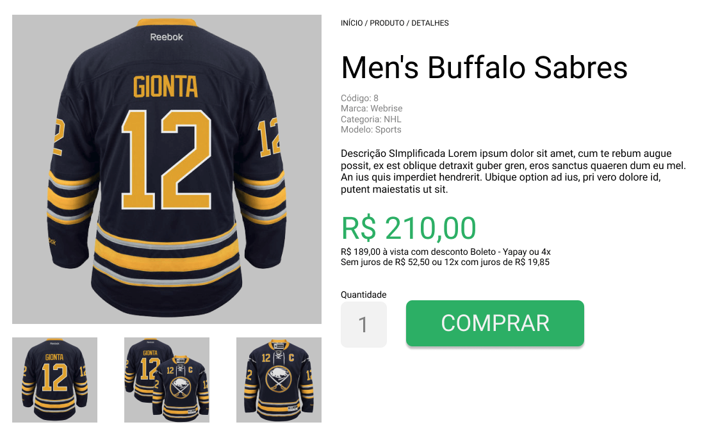

# Objetivo
  

O objetivo deste repositório é testar seu conhecimento em front-end, usando ferramentas do nosso dia a dia.

## O que deve ser feito
- Criar uma aplicação client-side que consulte uma api de produtos e mostre detalhes deste produto.  
- Esta aplicação deve funcionar nos principais navegadores do mercado.  

Aqui está um protótipo do layout que pode ser desenvolvido, você pode melhorar ele se quiser :)

## Desafio
Desenvolva a página utilizando as seguintes ferramentas 

### CSS
- Utilize algum pré-processador (de preferência Sass)
- Mifique seu código
- Fique à vontade para usar qualquer lib/framework

### JS
- Você pode utilizar Angular/React/Vue se preferir
- Se utilizar es6 garanta que ele rode em todos os navegadores
- Minifique seu código

### Diferenciais
- Ter uma ótima experiência para o usuário, independente do dispositivo
- Fazer um build do projeto numa pasta `dist`
- Criar um readme.md

## Como participar?
Aqui estão as informações necessárias para você começar
- O Link da [API](http://agenciatray.commercesuite.com.br/web_api/products/8)
- O Link do [protótipo](https://www.figma.com/file/dpk37h2Ko5Vtgb01WxaZ4THf/desafio)

Crie um zip do seu projeto e envie para contato@webrise.com.br :sunglasses:  
Lembre-se de nos dizer como rodar seu projeto.

Boa sorte! :v: